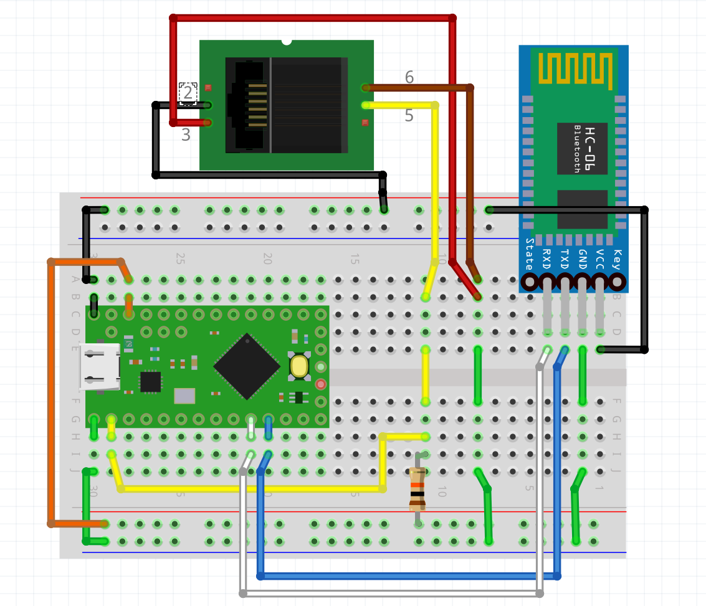
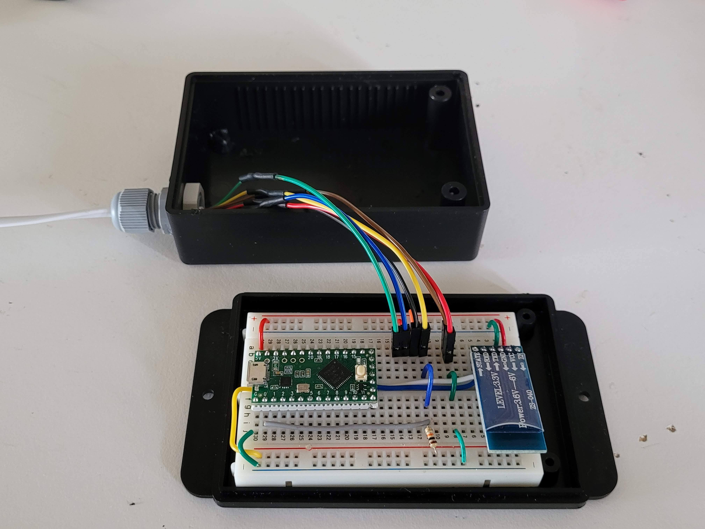
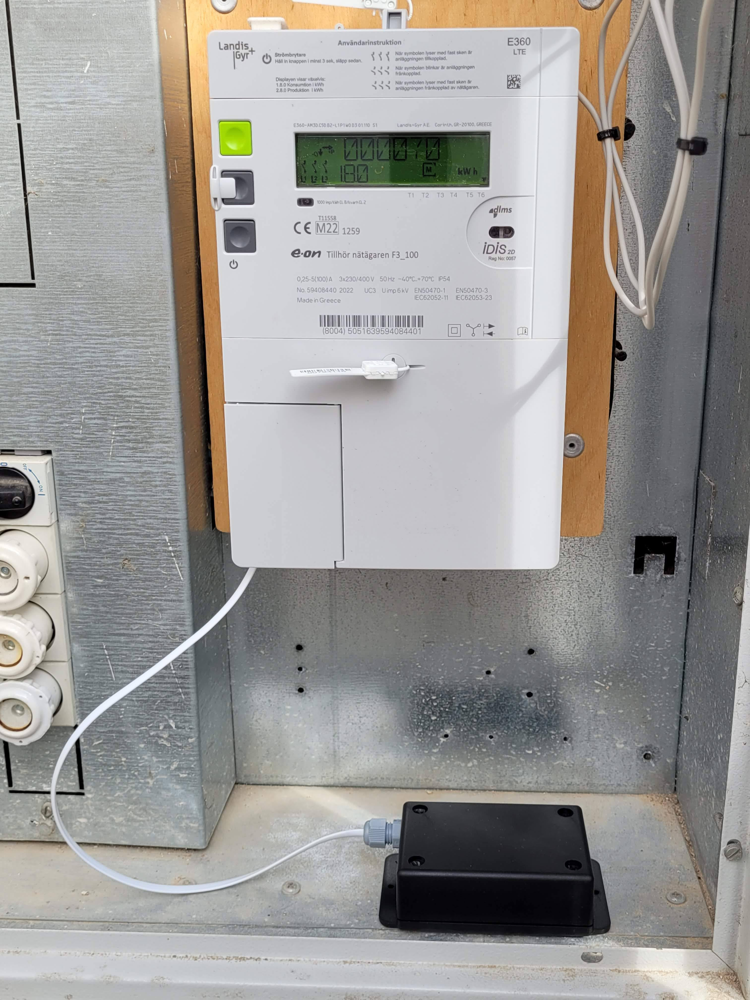

# Blinky Eon Mon Cube

The Blinky Eon Mon Cube connects to the P1 HAN port of any smart electric meter to read the smart electric meter. The cube is a very simple circuit and can be readily built on a breadboard.

The P1 HAN port is read by a  [Teensy LC](https://www.pjrc.com/teensy/teensyLC.html) micro-controller using the Teensy LC Serial 1 port. *Please note that the serial protocol to connect with the P1 HAN port is 115200 Baud,SERIAL_8N1_RXINV.*

The Teensy LC micro-controller communicates to the [Blinky Eon Mon tray](https://github.com/blinky-lite-energy-exchange/blinky-eon-mon-tray) with a serial Bluetooth connection very similar to the connection method described in the [Blinky Bus Cube](https://github.com/Blinky-Lite-Exchange/blinky-bus-cube) project with the exception that the Serial2 port is used on the Teensy LC.

 

 

 
